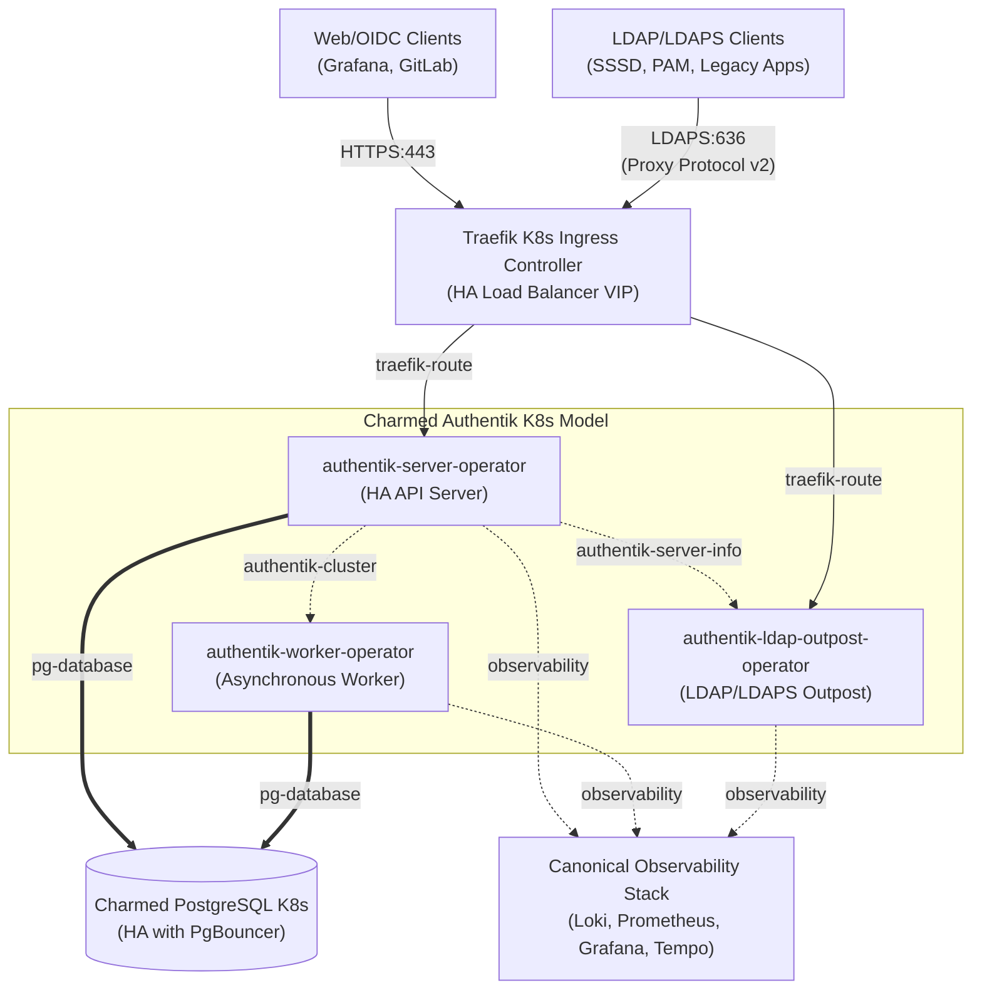
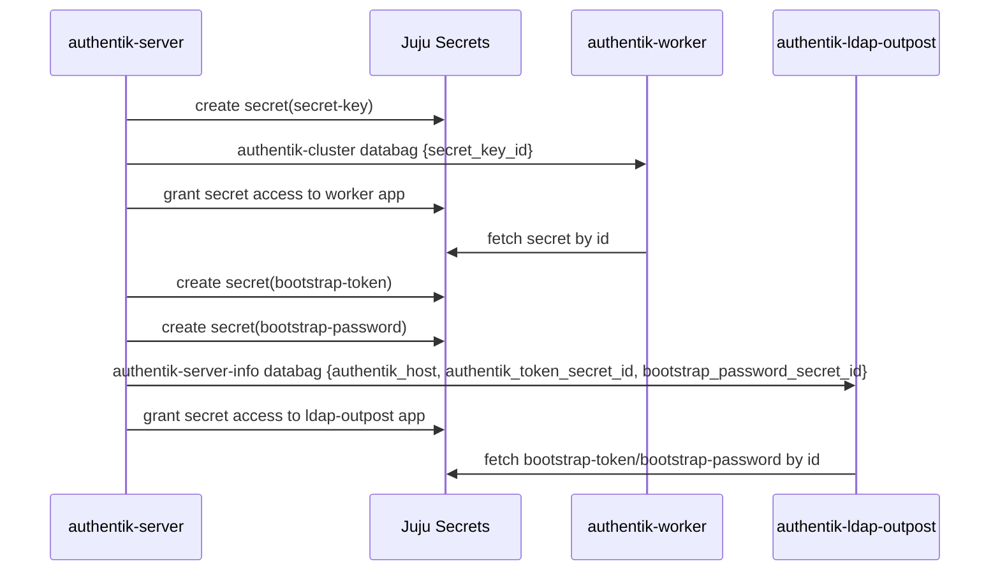

# Charmed Authentik Architecture & Security Design
### Explanation

This document provides a conceptual overview of the system architecture, relationship topology, communication boundaries, and security designs governing Charmed Authentik.

Charmed Authentik is an open-source, highly versatile Identity Provider (IdP) that delivers unified authentication, user management, and authorization. It is modeled in Juju as a cooperative suite of three independent Kubernetes operator charms:
1. **`authentik-server-operator`**: The core API server, admin dashboard, and web interface.
2. **`authentik-worker-operator`**: The asynchronous Dramatiq task worker handling directory syncs, emails, outposts, and background maintenance.
3. **`authentik-ldap-outpost-operator`**: A secure, lightweight LDAP/LDAPS directory gateway.

---

## 1. Component Relationship Topology

The Charmed Authentik suite integrates closely with PostgreSQL database services, Traefik Ingress controllers, and the Canonical Observability Stack (COS).

### Core Relations Overview

* **`pg-database` (PostgreSQL client)**: Both the `authentik-server` and `authentik-worker` charms connect independently to PostgreSQL. To ensure database cohesion, both applications request the exact same database name: `<model-name>_<server-app-name>`. For this reason, both charms must reside in the same Juju model and integrate with the same PostgreSQL provider.
* **`authentik-cluster` (Server $\rightarrow$ Worker)**: The server charm acts as the source of truth for the cluster encryption key (`AUTHENTIK_SECRET_KEY`) and database credentials, sharing them with the worker charm so background processes can decrypt cluster secrets.
* **`authentik-server-info` (Server $\rightarrow$ Outpost)**: Exposes the core server's API URL and a dedicated, least-privilege LDAP automation API token to the LDAP Outpost. This token is minted from a per-integration Authentik service account with a scoped role, distinct from the `akadmin` bootstrap token, which stays server-local and is used only for first startup, recovery, and automation-credential repair. The server likewise mints a separate scoped token for its own OAuth reconciliation. During a mixed-version upgrade the token secret carries both the canonical `api-token` key and a temporary `bootstrap-token` alias (both holding the dedicated LDAP token); the real bootstrap token is never shared over a relation.
* **`traefik-route` (Ingress integration)**: Enables the server and outpost to declare custom ingress endpoints, route traffic, manage TLS certificates, and configure TCP/HTTP entrypoints.

---

## 2. Security Boundaries & Trust Systems

Deploying Charmed Authentik in enterprise environments requires robust security isolation, non-interactive authentication logic, and high-fidelity traffic propagation.

### A. Dynamic, Relation-Driven Service Accounts
Sharing a single administrative credential across multiple downstream applications represents a critical security risk. To enforce the principle of least privilege, the Charmed Authentik LDAP Outpost implements isolated accounts:
1. **Zero Credential Sharing**: On a `relation-joined` event with a consuming client (such as SSSD), the outpost charm leader calls the Authentik REST API to provision a unique, isolated Service Account user (`ldap-client-<charm-name>-<relation-id>`) with a strong, randomly generated password.
2. **Access Revocation**: When the relation is severed (`relation-broken`), the corresponding Service Account user is instantly deleted from the Authentik database, preventing credential rot.
3. **Resource Efficiency**: Only **one** Kubernetes pod for the Outpost is spawned in the Juju model, serving all integrated downstream LDAP clients concurrently via their respective secure accounts.

### B. Automated Non-Interactive Bind Flow Resolution
Standard LDAP bind operations are non-interactive. The default Authentik authentication flow includes interactive multi-factor authentication (MFA) stages, which would ordinarily block command-line or machine-level LDAP binds.
* To address this, the charm automatically provisions a dedicated, non-interactive **LDAP Bind Flow** (`default-ldap-bind-flow`) containing only the `identification`, `password`, and `login` stages.
* This flow is automatically configured as the `authentication_flow` of the LDAP Provider, allowing machine-level clients to authenticate seamlessly and securely while protecting other enterprise flows.

### C. Implicit LDAPS Standard (Port 636)
To simplify network topologies and ensure a "fail-closed" secure posture, the operator suite strictly standardizes on implicit LDAPS (Port 636) for directory access. Cleartext LDAP with opportunistic StartTLS (Port 389) is not supported. 
TLS is terminated at the Traefik Ingress level (**Zero-Certificate Outpost** design). The `authentik-ldap-outpost` container remains completely lightweight and free of local certificate or trust store management.

### D. Proxy Protocol v2 & Client IP Propagation
For auditing, rate limiting, and brute-force lockout protection, Authentik must see the original client source IP rather than the internal ephemeral Traefik Pod IP. If all connections appear to originate from Traefik's IP, a single brute-force attack from one malicious client could trigger a lockout that blocks all directory traffic cluster-wide.

* **Layer 4 Limitations**: Because LDAP/LDAPS traffic operates over raw TCP (Layer 4), Traefik cannot inject standard Layer 7 HTTP headers (such as `X-Forwarded-For`). The standard solution for Layer 4 IP propagation is the **Proxy Protocol** (v2).
* **Dual-Layer Trust System**:
  - **Dynamic Discovery**: Query the `traefik-route` relation dynamically to read and append Juju-exchanged subnets or egress IPs.
  - **Static Private IP (RFC 1918) Trust**: Pre-seed `AUTHENTIK_LISTEN__TRUSTED_PROXY_CIDRS` with standard private ranges (`127.0.0.1/32`, `10.0.0.0/8`, `172.16.0.0/12`, `192.168.0.0/16`) to guarantee that any ephemeral Traefik Pod IP connecting over the internal Kubernetes overlay network is instantly recognized and trusted.
  - This ensures Authentik correctly identifies and rate-limits/locks-out malicious clients individually, preventing accidental cluster-wide denial of service.

---

## 3. Secret Exchange & Bootstrap Flow

Sensitive materials (keys, bootstrap credentials) are never stored in plain text or passed as unencrypted environment variables. They are fully managed via Juju Secrets.

Through this mechanism, non-leader units and related requirer charms always receive secret references as Juju Secret URIs, which they dynamically query from the Juju controller. This completely secures the identity perimeter of the deployment.
