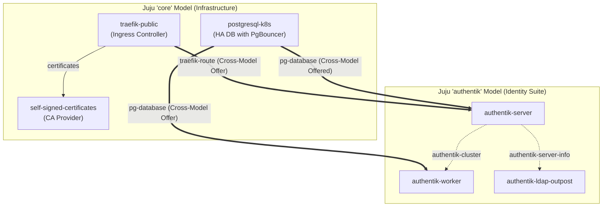

# Getting Started with Charmed Authentik
### Tutorial

Welcome to Charmed Authentik! This tutorial provides a guided, learning-oriented path to provision a complete, highly available, and secure Charmed Authentik solution stack from scratch.

To simplify deployment and establish a production-grade infrastructure-as-code baseline, we leverage the pre-configured Terraform scenario located directly within the operator workspace: **[terraform/solution/examples/tutorial](https://github.com/canonical/authentik-server-operator/tree/main/terraform/solution/examples/tutorial)**.

---

## 📋 What This Tutorial Deploys

Rather than deploying a flat single-model cluster, this scenario automates a multi-model topology separating core shared services from identity applications:



* **Juju Models**: Automates the creation of two isolated models: `core` (for shared ingress, database, and certificate authority) and `authentik` (for the Authentik suite).
* **Database**: Deploys Charmed PostgreSQL (`postgresql-k8s`) with cross-model integration.
* **Ingress**: Deploys Charmed Traefik Route (`traefik-k8s`) to publish the web interfaces.
* **TLS Certificates**: Deploys Charmed Self-Signed Certificates (`self-signed-certificates`) to secure Traefik's routing layer.
* **Authentik Suite**: Provisions the `authentik-server`, `authentik-worker`, and `authentik-ldap-outpost` operator apps, linking them seamlessly.

---

## 📋 Prerequisites

Before beginning, ensure your environment meets the following baseline:
1. **Terraform CLI** >= 1.6 installed locally.
2. A running **Kubernetes cluster** (e.g., MicroK8s, Charmed Kubernetes, or CDK).
3. A **Juju Controller** bootstrapped on your cluster.
4. Juju CLI and `kubectl` configured to access your cluster.

---

## 🚀 Quick Start Guide

### Step 1: Initialize Terraform
Navigate to the pre-configured tutorial directory in the server operator repository:
```bash
cd terraform/solution/examples/tutorial
terraform init
```

### Step 2: Orchestrate and Deploy the Stack
Deploy the entire cross-model infrastructure with a single execution. Terraform will automatically generate the Juju models, fetch the charms, and establish cross-model offers and integrations:
```bash
terraform apply -auto-approve
```

### Step 3: Monitor Deployment Settlement
The Juju controller will begin spin-up of the Kubernetes pods. You can watch the real-time status of both models:

```bash
# Monitor core shared services (DB, Ingress, Certs)
watch -c juju status -m core --color

# Monitor identity applications (Server, Worker, LDAP Outpost)
watch -c juju status -m authentik --color
```

A settled and operational stack will report `active` and `idle` across all units.

---

## 🔑 Retrieving Admin Credentials

During the initial database migration, Charmed Authentik automatically provisions the default administrator account (**`akadmin`**) with a strong, randomly generated bootstrap password.

To retrieve these credentials securely, run the `get-bootstrap-admin-credentials` action on the leader unit in the `authentik` model:

```bash
juju run -m authentik authentik-server/leader get-bootstrap-admin-credentials
```

The output will contain:
* `username`: `akadmin`
* `password`: *The generated secure administrator password*
* `bootstrap-token`: *The initial cluster-wide API token*

---

## 🌐 Accessing the Authentik Web UI

The Authentik admin dashboard is published securely via Traefik.

1. **Locate Traefik's Ingress Address**:
   Find the external address or IP associated with your Traefik Ingress:
   ```bash
   juju status -m core traefik-public
   ```
2. **Browse to the Portal**:
   Point your browser to the URL corresponding to your configured domain or Traefik LoadBalancer IP (e.g., `https://<traefik-ip>/`) and log in using your retrieved credentials.

---

## 🔒 Managing TLS Trust for Consumer Applications

> [!IMPORTANT]
> Because this tutorial provisions **self-signed SSL certificates**, integrated consumer applications (e.g., Grafana) will not trust Authentik's CA chain by default.
> 
> To automatically propagate and trust the CA certificate across your deployment, offer the CA service from the `core` model and integrate your consumer application over the `certificate_transfer` interface:
> 
> ```bash
> # 1. Offer the certificates from the core model
> juju offer -m core self-signed-certificates:send-ca-cert
> 
> # 2. Integrate your consumer application (e.g., grafana-k8s) to trust the CA chain
> juju integrate -m core <consumer-application>:receive-ca-cert admin/core.self-signed-certificates
> ```

---

## Next Steps

Now that your Charmed Authentik core is up and running:
* Proceed to the [How-To: Protect OIDC/OAuth Applications](../../docs/how-to/protect-oidc-oauth-applications.md) guide to configure Single Sign-On (SSO).
* Proceed to the [How-To: Protect LDAP Applications](../../docs/how-to/protect-ldap-applications.md) guide to connect secure directory services.
